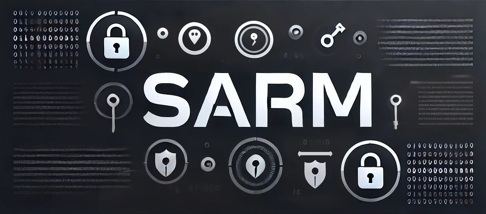

# SARM



## Project Overview

**SARM** (Secure Access and Real-time Management) is a robust encryption and file management tool designed to provide real-time protection for sensitive files across all types of storage devices, including local drives, external hard drives, USBs, and more. It utilizes **AES-GCM encryption** to ensure the security of files, offering seamless real-time decryption for access without retaining decrypted copies. This tool is currently available for **Windows** in its **beta phase**, with plans to expand to a **cross-platform** solution in the future.

SARM addresses critical privacy and security needs by ensuring that decrypted files are not left stored on any drive after they are accessed, making it ideal for handling highly sensitive data. All encryption and decryption processes are performed **in real-time**, maintaining security while providing smooth, transparent access.

## DEMO

Uploading Soon...

## Features

- **Real-time Encryption & Decryption**: Encrypts files and folders upon storage, with instant decryption when accessed, ensuring no decrypted copies remain.
- **AES-GCM Encryption**: Provides advanced encryption standards to secure data and ensure file integrity.
- **Argon2 Key Derivation**: Utilizes Argon2i for strong password protection.
- **Drag-and-Drop File Encryption**: Enables quick encryption of files and folders, preserving their original structure.
- **Minimalistic Dark-Themed UI**: Clean interface with hidden logs for a focused user experience.
- **Temporary File Cleanup**: Automatically removes all temporary files, ensuring no trace of decrypted data remains.
- **Multi-Select File Support**: Option to enable or disable multi-file selection for encryption/decryption.
- **Custom Decryption Path**: Choose to decrypt files to a temporary folder or their original path using a checkbox.
- **Safe Mode**: A feature that ensures all temporary files are securely deleted from the computer.
- **Full System Encryption Support**: Supports encryption and decryption of both local and external drives.

## Why SARM?

In an era of rampant data breaches, SARM ensures secure data management by preventing decrypted copies of files from being stored on any disk. It is designed to offer **real-time decryption** with **zero decrypted file storage**, ensuring sensitive files are never exposed.

With features like file encryption and comprehensive drive support, SARM serves users who require a robust, low-intervention solution for secure file management.

[](https://github.com/user-attachments/assets/6840fc61-0fbf-4573-9dbd-774a387543ba)

## Usage Guide

### Prerequisites

- **Operating System**: Windows
- **Python**: Ensure Python is installed on your system. You can download it from the [official Python website](https://www.python.org/downloads/).
- **Storage Devices**: Local or external

### Installation

Open a command prompt and run the following commands
   ```bash
   git clone https://github.com/junioralive/SARM.git
   cd SARM
   python sarm_app.py
   ```

## Planned Features

- **Cross-Platform Support**: Expanding to **Linux** and **macOS**.

## How to Contribute

Contributions are welcome. To contribute:

1. **Fork the repository**.
2. **Create a new branch** for your feature.
3. **Make your changes** and test them.
4. **Submit a pull request** with a detailed description.

## License

This project is licensed under the **MIT License**. See the [LICENSE](LICENSE) file for details.

## Contact

[](https://discord.gg/cwDTVKyKJz)
[](https://github.com/junioralive/box-stream)
[](mailto:support@junioralive.in)
